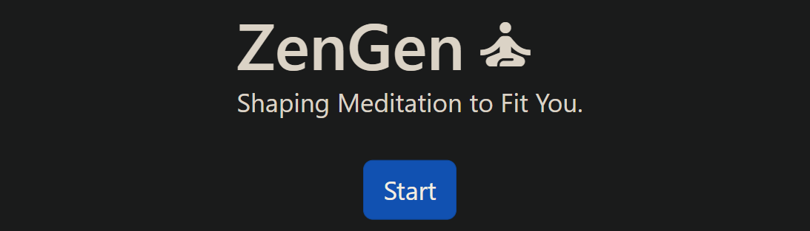

# ZenGen - Customized Meditation App



Welcome to [ZenGen](https://zengen.netlify.app/), a unique meditation app that empowers you to shape meditation sessions tailored to your preferences. Through a sleek and intuitive interface, ZenGen provides a personalized meditation experience, harnessing Text-to-Speech technology to offer real-time guidance based on your choices.

## Features

- **Personalized Meditations**: Create your own meditation experience by selecting the desired length, focus, and method, tailoring each session to your unique preferences.
  
- **Dynamic Content Generation**: Once you've set your meditation preferences, ZenGen communicates with ChatGPT to generate a meditation script tailored to your choices.
  
- **In-Browser Playback**: Listen to your personalized meditation right in your browser with integrated Text-to-Speech technology, providing a seamless guided experience.
  
- **Cross-Platform Compatibility**: ZenGen is designed for a consistent and user-friendly experience whether you're using a desktop or iOS devices, allowing you to meditate wherever you are.


## Technologies Used

- **Frontend**: React, Create React App
- **Backend**: Flask
- **Others**: Material Icons, Text-to-Speech API

## Getting Started

### Prerequisites

- Node.js (version 16.0.0 or higher) 
- npm (version 9.0.0 or higher)

### Installation and Setup

1. **Clone the Repository**:
    ```bash
    git clone https://github.com/csiv23/ZenGen.git
    ```

2. **Navigate to the frontend directory**:
    ```bash
    cd ZenGen/frontend
    ```

3. **Install the Dependencies**:
    ```bash
    npm install
    ```

4. **Start the Development Server**:
    ```bash
    npm start
    ```

Now, open your browser and access the app at [http://localhost:3000](http://localhost:3000).

### Deployment

For guidelines on deploying the app to production, refer to the [Create React App deployment guide](https://facebook.github.io/create-react-app/docs/deployment).

### Contributing

Your contributions are always welcome! Here's how you can contribute:

1. **Fork the Repository**.
2. **Create Your Feature Branch**: `git checkout -b feature/AmazingFeature`.
3. **Commit Your Changes**: `git commit -m 'Add some AmazingFeature'`.
4. **Push to the Branch**: `git push origin feature/AmazingFeature`.
5. **Open a Pull Request**.

### Acknowledgments

- This project was initialized with [Create React App](https://github.com/facebook/create-react-app).
- Icons are sourced from [Material Icons](https://material.io/resources/icons/).

### License

ZenGen is licensed under the MIT License. For detailed information, check the [LICENSE.md](LICENSE.md) file. 
